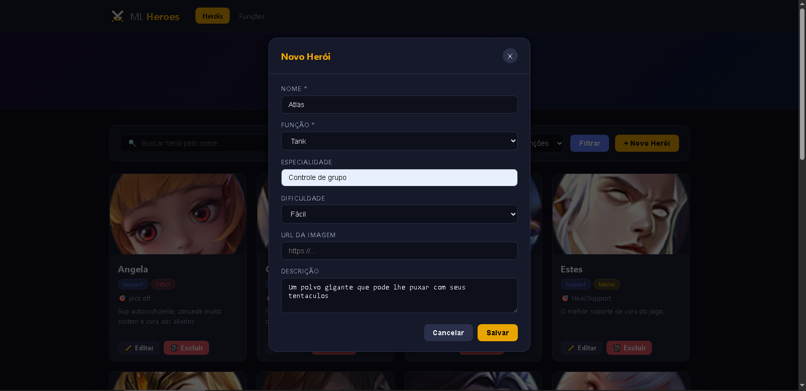
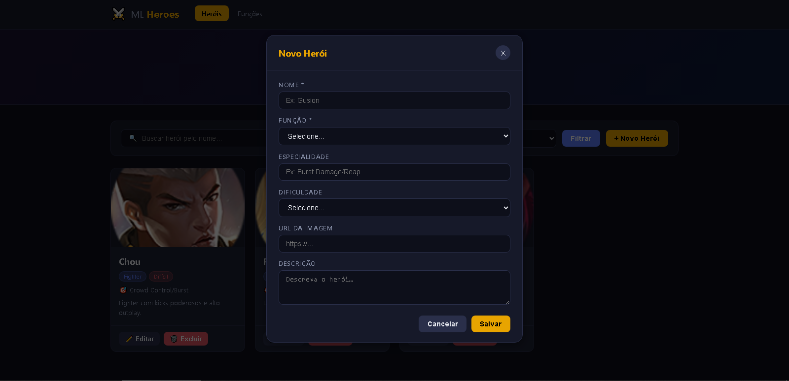
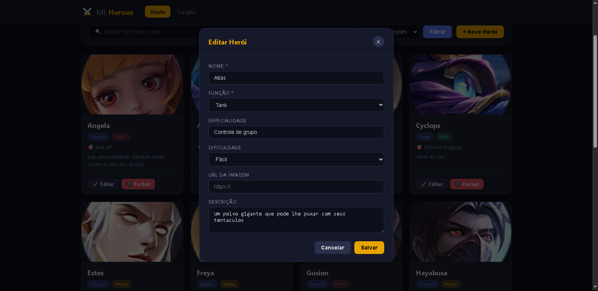
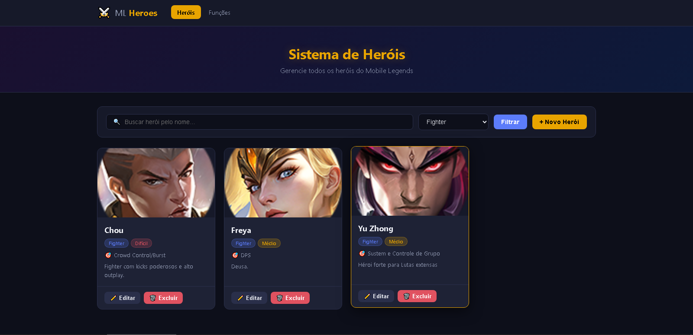
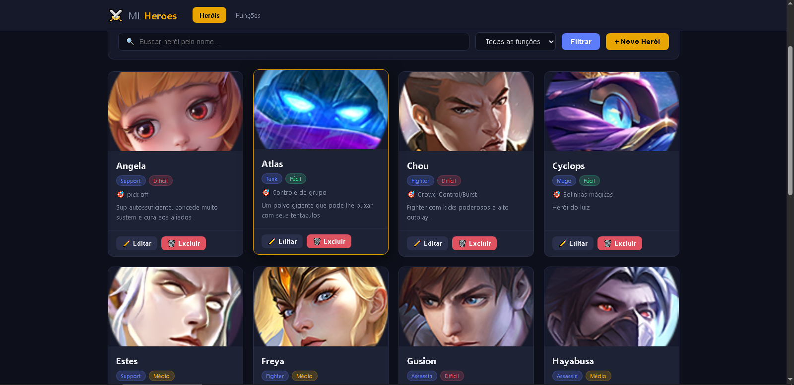
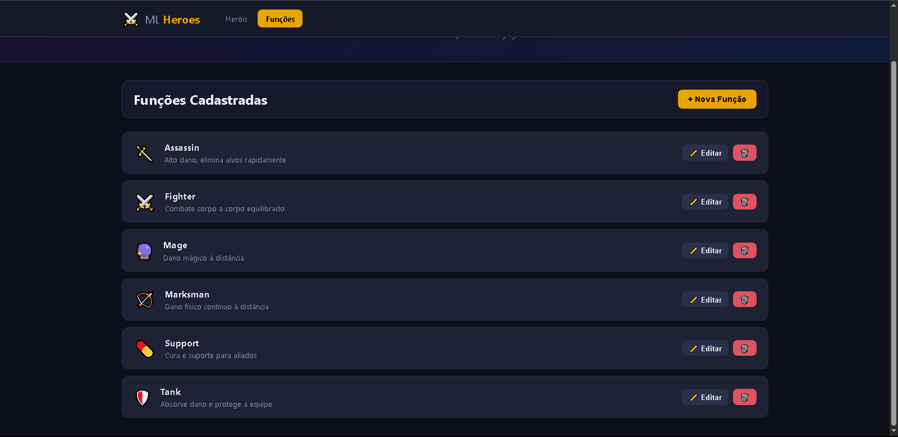
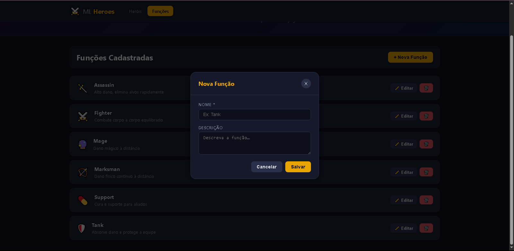
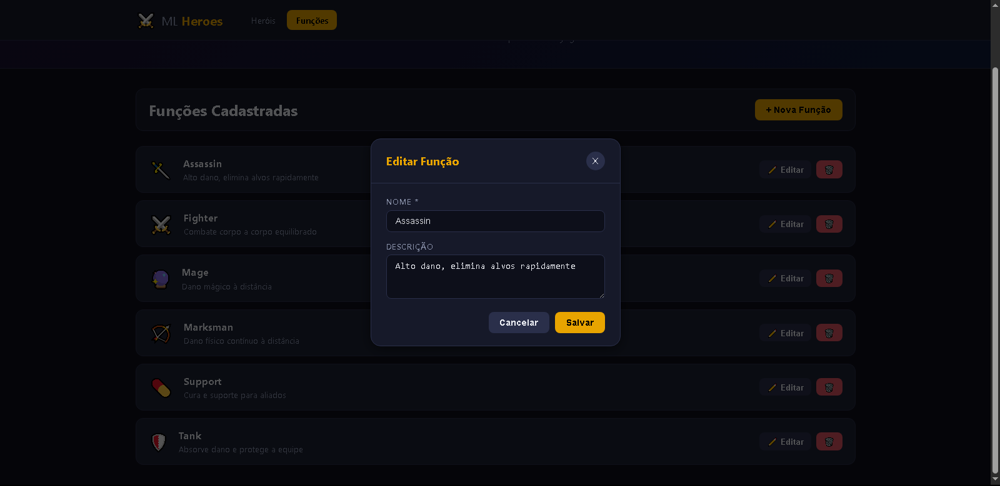
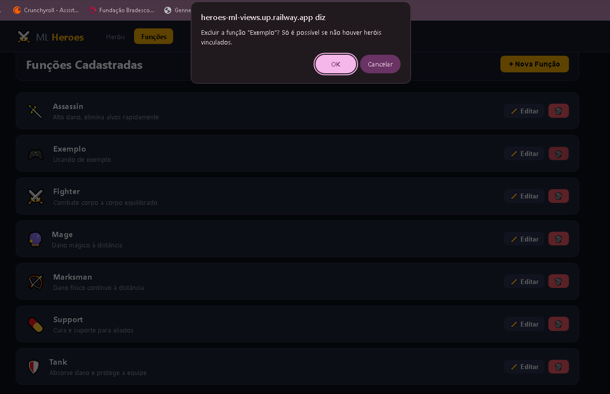
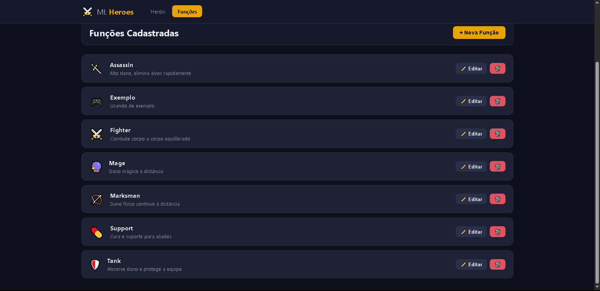

# ⚔️ ML Heroes — Sistema de Heróis do Mobile Legends

Sistema web Full Stack para gerenciar os heróis do Mobile Legends, desenvolvido com Node.js, Express, Supabase, HTML, CSS e JavaScript puro.

---

## 🎮 Descrição do Sistema

Permite realizar o CRUD completo de **heróis** e **funções (roles)** do Mobile Legends, com filtro por nome e função, interface escura temática e integração com banco de dados em nuvem via Supabase.

---

## 🛠️ Tecnologias Utilizadas

| Camada    | Tecnologia |
|-----------|------------|
| Back-end  | Node.js + Express |
| Banco     | Supabase (PostgreSQL) |
| Front-end | HTML5, CSS3, JavaScript (fetch + async/await) |
| HTTP      | API REST com JSON |

---

## 📁 Estrutura do Projeto

```
ml-heroes/
├── index.js          ← Servidor Express + rotas da API REST
├── package.json
├── supabase.sql      ← Script para criar as tabelas no Supabase
├── .env.example      ← Variáveis de ambiente necessárias
└── front/
    ├── index.html    ← Página principal (heróis)
    ├── css/
    │   └── style.css
    ├── js/
    │   ├── script.js   ← Lógica da página de heróis
    │   └── funcoes.js  ← Lógica da página de funções
    └── paginas/
        └── funcoes.html ← Página de funções (roles)
```

---

## ▶️ Como Executar o Projeto

### 1. Clonar o repositório
```bash
git clone https://github.com/seu-usuario/ml-heroes.git
cd ml-heroes
```

### 2. Instalar dependências
```bash
npm install
```

### 3. Configurar o Supabase
1. Acesse [supabase.com](https://supabase.com) e crie um projeto
2. No **SQL Editor**, execute o conteúdo do arquivo `supabase.sql`
3. Copie a **URL** e a **anon key** do projeto (Settings → API)

### 4. Configurar variáveis de ambiente
```bash
cp .env.example .env
```
Edite o arquivo `.env`:
```
SUPABASE_URL=https://xxxx.supabase.co
SUPABASE_KEY=sua_anon_key
PORT=3000
```

### 5. Iniciar o servidor
```bash
npm start
```

Acesse: **http://localhost:3000**

---

## 🔌 Endpoints da API

### Heróis
| Método | Rota | Descrição |
|--------|------|-----------|
| GET    | `/api/herois` | Lista todos (aceita `?busca=` e `?funcao_id=`) |
| GET    | `/api/herois/:id` | Retorna um herói |
| POST   | `/api/herois` | Cadastra novo herói |
| PUT    | `/api/herois/:id` | Atualiza herói |
| DELETE | `/api/herois/:id` | Exclui herói |

### Funções
| Método | Rota | Descrição |
|--------|------|-----------|
| GET    | `/api/funcoes` | Lista todas as funções |
| POST   | `/api/funcoes` | Cadastra nova função |
| PUT    | `/api/funcoes/:id` | Atualiza função |
| DELETE | `/api/funcoes/:id` | Exclui função |

---

## 🗃️ Banco de Dados (2 tabelas)

### `funcoes`
| Coluna    | Tipo    | Descrição |
|-----------|---------|-----------|
| id        | SERIAL  | PK |
| nome      | VARCHAR | Nome da função (Tank, Mage…) |
| descricao | TEXT    | Descrição |

### `herois`
| Coluna        | Tipo    | Descrição |
|---------------|---------|-----------|
| id            | SERIAL  | PK |
| nome          | VARCHAR | Nome do herói |
| funcao_id     | INT     | FK → funcoes.id |
| especialidade | VARCHAR | Ex: Burst Damage/Reap |
| dificuldade   | VARCHAR | Fácil / Médio / Difícil |
| descricao     | TEXT    | Descrição do herói |
| imagem_url    | TEXT    | URL da imagem |
| criado_em     | TIMESTAMP | Data de criação |

---

## ✅ Funcionalidades

- [x] Listar heróis com cards visuais
- [x] Cadastrar herói
- [x] Editar herói
- [x] Excluir herói
- [x] Filtrar por nome e função
- [x] CRUD de funções (roles)
- [x] Interface temática dark (Mobile Legends)
- [x] fetch() + async/await em todo o front-end
- [x] API REST com JSON
- [x] Integração com Supabase

---

## 📸 Prints do Sistema

### Heróis







### Funções




